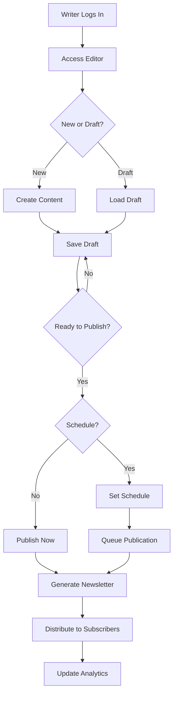
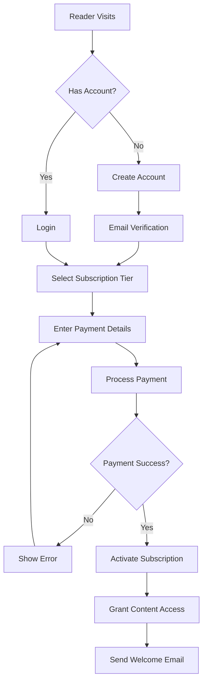
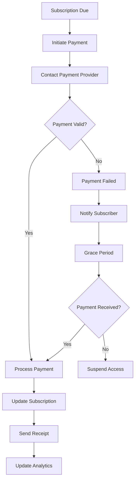
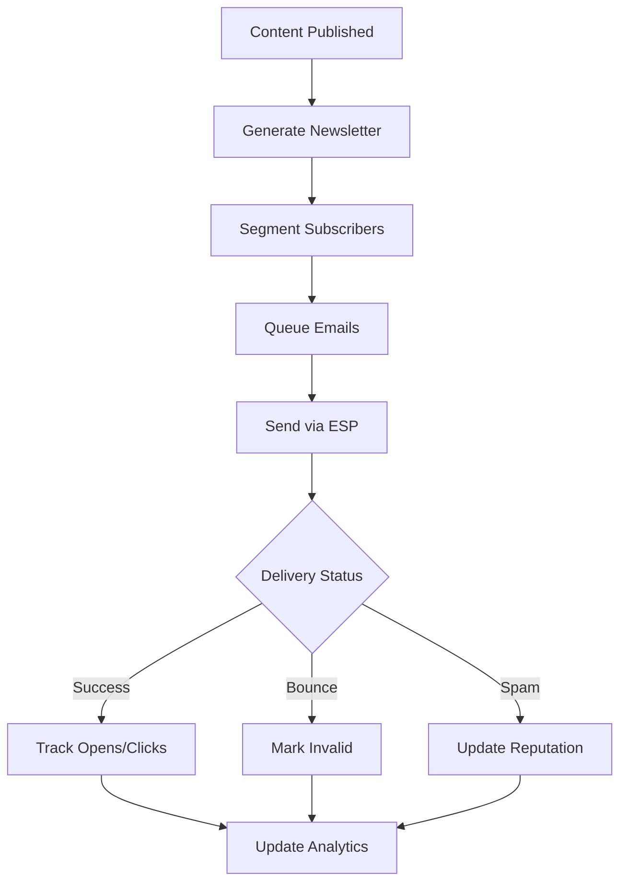
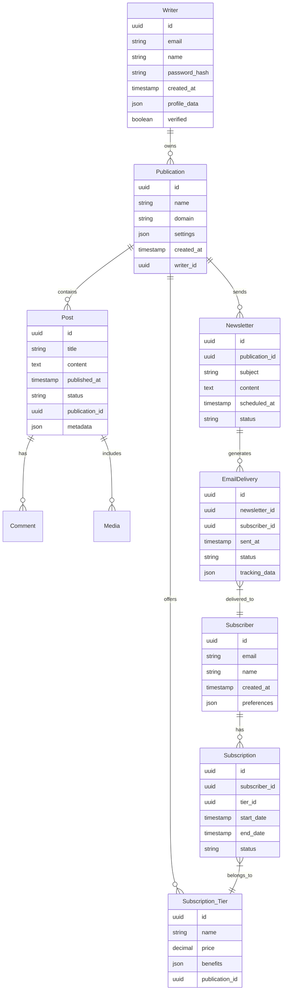
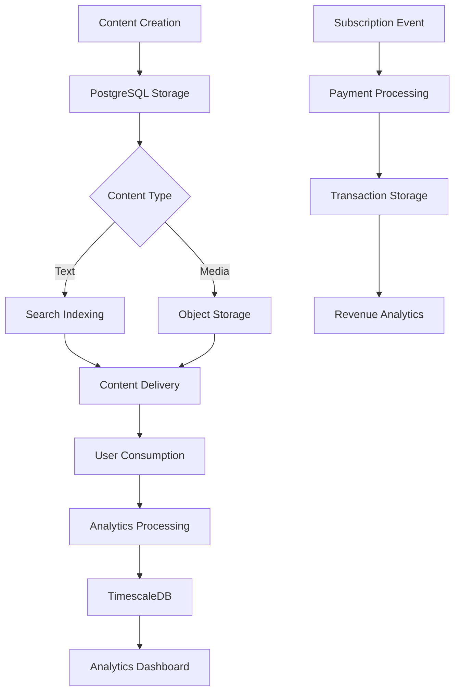

# Introduction

## Purpose

This Software Requirements Specification (SRS) document provides a comprehensive description of the Substack Replica platform. It details the functional and non-functional requirements for developers, project managers, QA teams, and stakeholders involved in the platform's development and deployment. The document serves as the primary reference for technical implementation and validation of the newsletter publishing and monetization system.

## Scope

The Substack Replica platform encompasses a full-featured content management and monetization system that enables:

- Newsletter creation and publishing through a web-based interface
- Subscription-based monetization with tiered pricing models
- Automated email delivery and subscriber management
- Analytics and performance tracking
- Payment processing and revenue management
- Content discovery and archival features

### In Scope

- Web-based content management system
- Email newsletter generation and distribution
- Subscription payment processing
- User authentication and account management
- Analytics and reporting dashboards
- Content search and discovery
- Mobile-responsive reader experience
- Integration with payment, email, and storage services

### Out of Scope

- Native mobile applications
- Offline content editing
- Print publication features
- Direct advertising integration
- Third-party content syndication
- Podcast or video hosting
- Community forum features
- Custom domain SSL management

# Product Description

## Product Perspective
The Substack Replica platform operates as a standalone web-based content management and monetization system, interfacing with several external services:

- Payment processing systems (Stripe, PayPal) for subscription management
- Email delivery services (SendGrid/Mailgun) for newsletter distribution
- Cloud storage providers (AWS S3/GCP Storage) for media handling
- Content delivery networks for optimized asset delivery
- Authentication providers for user management

The system follows a cloud-native architecture with distributed components handling specific functions while maintaining a unified experience for both writers and readers.

## Product Functions
The platform provides the following core functions:

1. Content Management
   - Rich text editing with markdown support
   - Draft management and version control
   - Scheduled publishing
   - Media upload and optimization
   - Newsletter template creation

2. Subscription Management
   - Tiered subscription models
   - Automated billing and renewals
   - Payment processing
   - Subscriber relationship management
   - Access control for premium content

3. Email Operations
   - Newsletter generation
   - Automated distribution
   - Subscriber list management
   - Email analytics
   - Bounce and spam handling

4. Analytics and Reporting
   - Subscriber growth metrics
   - Revenue tracking
   - Content performance analysis
   - Email engagement statistics
   - Audience insights

## User Characteristics

1. Content Creators (Writers)
   - Professional writers and journalists
   - Subject matter experts
   - Independent publishers
   - Technical expertise: Low to moderate
   - Primary needs: Content creation, audience growth, monetization

2. Subscribers (Readers)
   - Knowledge seekers
   - Professional audience
   - Topic enthusiasts
   - Technical expertise: Basic
   - Primary needs: Content consumption, subscription management

3. Platform Administrators
   - Technical support staff
   - Content moderators
   - System administrators
   - Technical expertise: High
   - Primary needs: Platform maintenance, user support

## Constraints

1. Technical Constraints
   - Browser compatibility requirements (support for latest 2 versions of major browsers)
   - Maximum email size limit of 10MB
   - API rate limits for external services
   - Storage limitations for media files
   - Email delivery throughput restrictions

2. Regulatory Constraints
   - GDPR compliance requirements
   - CCPA compliance requirements
   - PCI DSS compliance for payment processing
   - Data retention policies
   - Privacy law compliance across jurisdictions

3. Business Constraints
   - Platform fee structure (10% of subscription revenue)
   - Payment processing timeframes
   - Subscription price boundaries ($5-$500/month)
   - Support response time requirements
   - Content moderation requirements

## Assumptions and Dependencies

### Assumptions
1. Users have reliable internet connectivity
2. Writers own or have rights to their published content
3. Subscribers have valid payment methods
4. Email providers maintain high deliverability rates
5. Cloud service providers maintain 99.9% uptime

### Dependencies
1. External Services
   - Payment gateway availability
   - Email service provider reliability
   - Cloud storage accessibility
   - CDN performance
   - Authentication service uptime

2. Technical Dependencies
   - PostgreSQL database system
   - Elasticsearch functionality
   - Redis caching system
   - SSL certificate availability
   - DNS service reliability

3. Business Dependencies
   - Payment processor agreements
   - Email service provider contracts
   - Cloud service provider terms
   - Legal compliance verification
   - Security audit clearance

# Process Flowchart

The following diagrams illustrate the key workflows within the Substack Replica platform.

## Content Publishing Flow

## Subscription Management Flow

## Payment Processing Flow

## Email Distribution Flow

# Functional Requirements

## Content Management System (CMS)

### ID: FR-CMS
### Description: Core publishing platform enabling content creation, editing, and management
### Priority: P0 (Critical)

| Requirement ID | Requirement Description | Acceptance Criteria |
|---------------|------------------------|-------------------|
| FR-CMS-01 | Rich text editor with markdown support | - Support for headers, lists, quotes, links - Image/video embedding - Code block formatting - Real-time preview |
| FR-CMS-02 | Draft management system | - Auto-save every 2 minutes - Version history - Draft restoration - Multiple draft support |
| FR-CMS-03 | Publishing workflow | - Schedule future posts - Review interface - Post status tracking - Bulk post management |
| FR-CMS-04 | Media management | - Image upload up to 10MB - Automatic image optimization - Media library - CDN integration |
| FR-CMS-05 | Content organization | - Categories/tags - Search functionality - Archive management - Content filtering |

## Subscription Management

### ID: FR-SUB
### Description: Subscription handling and access control system
### Priority: P0 (Critical)

| Requirement ID | Requirement Description | Acceptance Criteria |
|---------------|------------------------|-------------------|
| FR-SUB-01 | Subscription tier management | - Multiple tier creation - Price range $5-$500 - Custom tier benefits - Tier comparison display |
| FR-SUB-02 | Payment processing | - Stripe/PayPal integration - Automated billing - Failed payment handling - Refund processing |
| FR-SUB-03 | Access control | - Content restriction by tier - Preview snippets - Subscriber verification - Grace period handling |
| FR-SUB-04 | Subscriber management | - Subscriber list management - Import/export capability - Status tracking - Communication tools |
| FR-SUB-05 | Revenue tracking | - Real-time revenue dashboard - Payment history - Platform fee calculation - Payout management |

## Email Distribution System

### ID: FR-EMAIL
### Description: Newsletter generation and distribution management
### Priority: P0 (Critical)

| Requirement ID | Requirement Description | Acceptance Criteria |
|---------------|------------------------|-------------------|
| FR-EMAIL-01 | Newsletter generation | - Template customization - Content formatting - Preview functionality - Mobile optimization |
| FR-EMAIL-02 | Distribution management | - Scheduled sending - Subscriber segmentation - Delivery tracking - Bounce handling |
| FR-EMAIL-03 | Email analytics | - Open rate tracking - Click tracking - Engagement metrics - Performance reports |
| FR-EMAIL-04 | List management | - Subscriber preferences - Unsubscribe handling - Email validation - List cleaning |
| FR-EMAIL-05 | Deliverability optimization | - SPF/DKIM setup - Reputation monitoring - Spam score checking - Delivery rate optimization |

## Analytics Platform

### ID: FR-ANALYTICS
### Description: Comprehensive analytics and reporting system
### Priority: P1 (High)

| Requirement ID | Requirement Description | Acceptance Criteria |
|---------------|------------------------|-------------------|
| FR-ANALYTICS-01 | Audience analytics | - Subscriber growth tracking - Demographics analysis - Engagement metrics - Retention rates |
| FR-ANALYTICS-02 | Content analytics | - Post performance metrics - Reading time tracking - Popular content identification - Conversion tracking |
| FR-ANALYTICS-03 | Revenue analytics | - Revenue forecasting - Subscription trends - Churn analysis - LTV calculations |
| FR-ANALYTICS-04 | Email analytics | - Delivery statistics - Engagement tracking - A/B test results - Campaign comparison |
| FR-ANALYTICS-05 | Custom reporting | - Report builder - Data export options - Scheduled reports - Dashboard customization |

## Search and Discovery

### ID: FR-SEARCH
### Description: Content discovery and search functionality
### Priority: P1 (High)

| Requirement ID | Requirement Description | Acceptance Criteria |
|---------------|------------------------|-------------------|
| FR-SEARCH-01 | Search functionality | - Full-text search - Advanced filters - Search suggestions - Result ranking |
| FR-SEARCH-02 | Content discovery | - Recommendation engine - Related content - Popular posts - Category browsing |
| FR-SEARCH-03 | Writer discovery | - Writer profiles - Topic categorization - Popularity metrics - Featured writers |
| FR-SEARCH-04 | Archive management | - Timeline view - Category archives - Tag archives - Search within archives |
| FR-SEARCH-05 | SEO optimization | - Meta tag management - Sitemap generation - URL optimization - Schema markup |

# Non-Functional Requirements

## Performance Requirements

| Metric | Requirement | Measurement Criteria |
|--------|-------------|---------------------|
| Page Load Time | < 2 seconds | 95th percentile under normal load |
| API Response Time | < 500ms | 99th percentile for all API endpoints |
| Email Delivery | < 5 minutes | From publish to delivery completion |
| Search Latency | < 200ms | 90th percentile for search queries |
| Database Query Time | < 100ms | 95th percentile for read operations |
| CDN Response Time | < 100ms | For static assets globally |
| Concurrent Users | 10,000+ | Without performance degradation |
| Newsletter Processing | 100,000/hour | Email generation and queuing |

## Safety Requirements

| Category | Requirement | Implementation |
|----------|-------------|----------------|
| Data Backup | Daily automated backups | - Full database backup daily - Incremental backups every 6 hours - 30-day retention period |
| Disaster Recovery | RPO: 1 hour, RTO: 4 hours | - Multi-region failover - Automated recovery procedures - Regular DR testing |
| System Monitoring | 24/7 monitoring | - Real-time alert system - Performance monitoring - Error tracking and logging |
| Fault Tolerance | No single point of failure | - Redundant systems - Load balancing - Circuit breakers |
| Data Loss Prevention | Zero data loss tolerance | - Transaction logging - Write-ahead logging - Corruption detection |

## Security Requirements

| Category | Requirement | Specification |
|----------|-------------|---------------|
| Authentication | Multi-factor authentication | - OAuth 2.0 implementation - 2FA for sensitive operations - Session management |
| Authorization | Role-based access control | - Granular permissions - Least privilege principle - Regular access reviews |
| Data Encryption | Industry-standard encryption | - AES-256 for data at rest - TLS 1.3 for data in transit - Key rotation every 90 days |
| Privacy | Data protection measures | - Data anonymization - Privacy by design - Consent management |
| Security Monitoring | Continuous security scanning | - Weekly vulnerability scans - Real-time threat detection - Security incident response |

## Quality Requirements

### Availability
- System uptime: 99.9%
- Planned maintenance: < 4 hours/month
- Service degradation: < 0.1%
- Recovery time: < 4 hours

### Maintainability
- Code coverage: > 80%
- Documentation coverage: 100%
- Technical debt ratio: < 5%
- Deployment frequency: Daily capability

### Usability
- Learning curve: < 1 hour for basic functions
- Error rate: < 1% for common operations
- Support ticket volume: < 2% of active users
- User satisfaction: > 4.5/5 rating

### Scalability
- Horizontal scaling: 0-100 instances
- Storage scaling: 0-10TB per tenant
- Network scaling: 0-10Gbps
- User scaling: 0-1M subscribers per publication

### Reliability
- Mean Time Between Failures: > 720 hours
- Mean Time To Recovery: < 30 minutes
- Error Budget: 0.1% per month
- Bug Resolution Time: < 24 hours for critical issues

## Compliance Requirements

| Requirement | Specification | Implementation |
|-------------|---------------|----------------|
| GDPR | EU data protection | - Data processing agreements - Right to be forgotten - Data portability - Privacy impact assessments |
| CCPA | California privacy law | - Data disclosure mechanisms - Opt-out systems - Privacy policy compliance - Data tracking transparency |
| PCI DSS | Payment security | - Secure payment processing - Cardholder data protection - Regular security assessments - Compliance auditing |
| SOC 2 | Security controls | - Access controls - System monitoring - Risk management - Regular audits |
| COPPA | Child protection | - Age verification - Parental consent - Data collection limitations - Privacy safeguards |

# Data Requirements

## Data Models

The following entity relationship diagram illustrates the core data structure of the platform:

## Data Storage

### Primary Storage

| Data Type | Storage System | Retention Period | Backup Frequency |
|-----------|---------------|------------------|------------------|
| User Data | PostgreSQL | Indefinite | Daily full, 6-hour incremental |
| Content | PostgreSQL | Indefinite | Daily full, 6-hour incremental |
| Media Files | S3/GCP Storage | Indefinite | Daily snapshot |
| Analytics | TimescaleDB | 24 months | Weekly full |
| Search Index | Elasticsearch | Dynamic | Daily snapshot |
| Cache | Redis | Temporary | No backup required |

### Redundancy Requirements

- Database: Multi-AZ deployment with synchronous replication
- Object Storage: Cross-region replication with 99.999999999% durability
- Search Index: 3-node cluster with 1 primary and 2 replica shards
- Cache: Redis cluster with primary-replica configuration

### Backup Strategy

| Component | Method | Retention | Recovery SLA |
|-----------|--------|-----------|--------------|
| Database | Point-in-time recovery | 30 days | 4 hours |
| Media Files | Cross-region copies | Indefinite | 2 hours |
| Search Index | Snapshot repository | 7 days | 1 hour |
| User Data | Encrypted archives | 7 years | 8 hours |

## Data Processing

### Data Flow

### Data Security

| Layer | Security Measure | Implementation |
|-------|-----------------|----------------|
| Transport | TLS 1.3 | All data in transit |
| Storage | AES-256 | All data at rest |
| Application | Field-level encryption | PII and payment data |
| Database | Row-level security | Multi-tenant isolation |
| Backup | Encrypted snapshots | All backup data |

### Data Processing Requirements

| Process | Requirement | SLA |
|---------|-------------|-----|
| Content Indexing | Near real-time | < 30 seconds |
| Analytics Processing | Batch processing | < 15 minutes |
| Email Generation | Queue-based processing | < 5 minutes |
| Media Optimization | Async processing | < 2 minutes |
| Search Updates | Incremental updates | < 1 minute |

# External Interfaces

## User Interfaces

### Writer Interface Requirements

| Interface Component | Requirements | Specifications |
|--------------------|--------------|----------------|
| Content Editor | - Rich text WYSIWYG editor - Markdown support - Media embedding - Real-time preview | - TinyMCE/ProseMirror implementation - Responsive layout - Keyboard shortcuts - Autosave indicators |
| Dashboard | - Analytics overview - Subscriber management - Revenue tracking - Content management | - Material Design components - Mobile-responsive grid - Real-time updates - Customizable widgets |
| Publication Settings | - Brand customization - Subscription tier management - Email template editor - Integration settings | - Form validation - Live preview - Drag-and-drop interface - Responsive controls |

### Reader Interface Requirements

| Interface Component | Requirements | Specifications |
|--------------------|--------------|----------------|
| Article View | - Clean reading experience - Typography optimization - Social sharing - Comment system | - Variable width layout - Dark mode support - Estimated read time - Progress indicator |
| Subscription Management | - Account settings - Payment management - Subscription status - Email preferences | - Secure forms - Payment method updates - Subscription history - Email frequency controls |
| Content Discovery | - Search interface - Category browsing - Writer profiles - Recommendations | - Search autocomplete - Filter controls - Infinite scroll - Related content |

## Software Interfaces

### Payment Processing Interfaces

| Service | Interface Type | Specifications |
|---------|---------------|----------------|
| Stripe | REST API | - API Version: 2022-11-15 - Webhook integration - Strong Customer Authentication (SCA) - Automatic retries |
| PayPal | REST API | - API Version: v2 - OAuth 2.0 authentication - IPN notifications - Dispute handling |

### Email Service Interfaces

| Service | Interface Type | Specifications |
|---------|---------------|----------------|
| SendGrid | REST API | - API Version: v3 - SMTP relay - Event webhooks - Template management |
| Mailgun | REST API | - API Version: v3 - SMTP integration - Delivery tracking - Bounce handling |

### Storage Service Interfaces

| Service | Interface Type | Specifications |
|---------|---------------|----------------|
| AWS S3 | REST API | - API Version: 2006-03-01 - Direct uploads - CDN integration - Lifecycle policies |
| GCP Storage | REST API | - JSON API v1 - Signed URLs - Object versioning - Access control |

## Communication Interfaces

### API Protocols

| Protocol | Usage | Specifications |
|----------|-------|---------------|
| HTTPS | All external communication | - TLS 1.3 - Certificate pinning - HSTS enabled - Perfect forward secrecy |
| WebSocket | Real-time updates | - WSS protocol - Heartbeat monitoring - Auto-reconnection - Message queuing |
| SMTP | Email delivery | - TLS encryption - DKIM signing - SPF verification - DMARC compliance |

### Data Formats

| Format | Usage | Specifications |
|--------|-------|---------------|
| JSON | API responses | - UTF-8 encoding - Compression enabled - Schema validation - Versioning support |
| HTML | Email templates | - Responsive design - Email client compatibility - Inline CSS - Plain text fallback |
| Markdown | Content storage | - CommonMark spec - GFM extensions - Custom extensions - HTML sanitization |

### Network Requirements

| Requirement | Specification | Implementation |
|-------------|---------------|----------------|
| Bandwidth | Minimum 100Mbps | - CDN distribution - Load balancing - Traffic optimization |
| Latency | < 100ms RTT | - Global edge locations - Connection pooling - Request prioritization |
| Availability | 99.9% uptime | - Redundant connections - Failover routing - Health monitoring |

# APPENDICES

## GLOSSARY

| Term | Definition |
|------|------------|
| Content Creator | Individual or organization publishing content through the platform |
| ESP | Email Service Provider - handles email delivery infrastructure |
| Grace Period | Time allowed after failed payment before subscription suspension |
| LTV | Lifetime Value - total revenue expected from a subscriber |
| Premium Content | Content restricted to paid subscribers |
| Publication | A writer's newsletter/content collection on the platform |
| Rich Text Editor | WYSIWYG interface for content creation with formatting tools |
| Subscriber | User who follows and potentially pays for access to content |
| Tier | Subscription level with specific pricing and benefits |
| WYSIWYG | What You See Is What You Get - visual content editor |

## ACRONYMS

| Acronym | Expansion |
|---------|-----------|
| API | Application Programming Interface |
| AWS | Amazon Web Services |
| CCPA | California Consumer Privacy Act |
| CDN | Content Delivery Network |
| CMS | Content Management System |
| COPPA | Children's Online Privacy Protection Act |
| DKIM | DomainKeys Identified Mail |
| DMARC | Domain-based Message Authentication, Reporting & Conformance |
| DR | Disaster Recovery |
| GDPR | General Data Protection Regulation |
| GCP | Google Cloud Platform |
| HSTS | HTTP Strict Transport Security |
| IPN | Instant Payment Notification |
| OAuth | Open Authorization |
| PCI DSS | Payment Card Industry Data Security Standard |
| PII | Personally Identifiable Information |
| RPO | Recovery Point Objective |
| RTO | Recovery Time Objective |
| SCA | Strong Customer Authentication |
| SOC | Service Organization Control |
| SPF | Sender Policy Framework |
| SQL | Structured Query Language |
| TLS | Transport Layer Security |
| UUID | Universally Unique Identifier |

## ADDITIONAL REFERENCES

| Resource | Description | URL |
|----------|-------------|-----|
| AWS S3 Documentation | Object storage service documentation | https://docs.aws.amazon.com/s3/ |
| CommonMark Spec | Markdown specification reference | https://spec.commonmark.org/ |
| GDPR Guidelines | Official EU GDPR compliance guide | https://gdpr.eu/guidelines/ |
| Material Design | UI component design system | https://material.io/design |
| OAuth 2.0 Specification | Authentication protocol documentation | https://oauth.net/2/ |
| PCI Compliance Guide | Payment security requirements | https://www.pcisecuritystandards.org/ |
| SendGrid API Reference | Email service API documentation | https://docs.sendgrid.com/api-reference |
| Stripe API Documentation | Payment processing integration guide | https://stripe.com/docs/api |
| TinyMCE Documentation | Rich text editor implementation guide | https://www.tiny.cloud/docs/ |
| WebSocket Protocol | Real-time communication specification | https://datatracker.ietf.org/doc/html/rfc6455 |