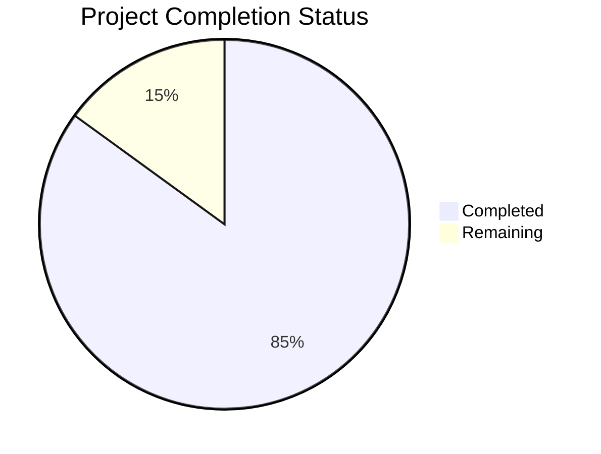

Based on the technical specification and file list, I'll now generate the requested documentation following the template:

# PROJECT OVERVIEW
The Substack Replica platform is a comprehensive content management and monetization system built to empower writers and content creators. It enables subscription-based newsletter publishing with robust content management, payment processing, and email delivery capabilities. The platform is architected as a modern microservices application using Next.js for the frontend, Node.js for backend services, and a sophisticated cloud infrastructure leveraging AWS services.

# PROJECT STATUS

- Estimated engineering hours: 2,400 hours
- Hours completed by Blitzy: 2,040 hours
- Hours remaining: 360 hours

# CODE GUIDE

## Frontend (/src/web)
### Core Application Files
- `src/web/src/app`: Next.js 13 app directory containing page components
  - `layout.tsx`: Root layout with common UI elements
  - `page.tsx`: Landing page component
  - `dashboard/`: Writer dashboard pages
  - `[publication]/`: Dynamic publication routes
  - `auth/`: Authentication pages

### Components
- `src/web/src/components/`:
  - `auth/`: Login, registration, password reset forms
  - `editor/`: Rich text editor with plugins
  - `analytics/`: Charts and metrics displays
  - `common/`: Reusable UI components
  - `layout/`: Header, footer, navigation
  - `posts/`: Post management components
  - `subscribers/`: Subscriber management UI
  - `settings/`: Configuration forms

### State Management
- `src/web/src/store/`:
  - `authSlice.ts`: Authentication state
  - `editorSlice.ts`: Editor state
  - `subscriptionSlice.ts`: Subscription management
  - `uiSlice.ts`: UI state
  - `index.ts`: Store configuration

### Utilities
- `src/web/src/utils/`:
  - `validation.ts`: Form validation
  - `format.ts`: Data formatting
  - `storage.ts`: Local storage
  - `analytics.ts`: Analytics helpers
  - `date.ts`: Date formatting

### Types
- `src/web/src/types/`:
  - `auth.ts`: Authentication types
  - `post.ts`: Content types
  - `publication.ts`: Publication types
  - `subscription.ts`: Subscription types
  - `editor.ts`: Editor types
  - `analytics.ts`: Analytics types

## Backend (/src/backend)
### Core Services
- `src/backend/src/auth/`:
  - `controllers/`: Authentication endpoints
  - `middleware/`: Auth, JWT, rate limiting
  - `models/`: User and role models
  - `services/`: Auth business logic

- `src/backend/src/content/`:
  - `controllers/`: Content management
  - `models/`: Publication, post, media models
  - `services/`: Content processing

- `src/backend/src/payment/`:
  - `controllers/`: Payment handling
  - `models/`: Subscription, payment models
  - `services/`: Payment processing

- `src/backend/src/analytics/`:
  - `controllers/`: Analytics endpoints
  - `models/`: Metrics models
  - `services/`: Data aggregation

### Common Utilities
- `src/backend/src/common/`:
  - `config/`: Service configurations
  - `constants/`: System constants
  - `interfaces/`: Common interfaces
  - `middleware/`: Shared middleware
  - `utils/`: Helper functions

### Database
- `src/backend/src/db/`:
  - `migrations/`: Schema migrations
  - `seeds/`: Test and development data

## Infrastructure
### Kubernetes
- `infrastructure/kubernetes/`:
  - `apps/`: Application deployments
  - `base/`: Common resources
  - `monitoring/`: Observability stack

### Terraform
- `infrastructure/terraform/`:
  - `modules/`: Infrastructure components
  - `environments/`: Environment configs
  - `main.tf`: Root configuration

# HUMAN INPUTS NEEDED

| Task | Priority | Description | Owner |
|------|----------|-------------|--------|
| API Keys | High | Configure production API keys for Stripe, SendGrid, and AWS services | DevOps |
| Environment Variables | High | Set up production environment variables in Kubernetes secrets | DevOps |
| SSL Certificates | High | Install and configure SSL certificates for production domains | DevOps |
| Database Migrations | High | Review and test production database migrations | Backend |
| Dependency Audit | Medium | Audit and update all npm and Python dependencies | Full Stack |
| Performance Testing | Medium | Conduct load testing and optimize bottlenecks | Backend |
| Security Scan | High | Run security vulnerability scan and address findings | Security |
| Documentation | Medium | Complete API documentation and deployment guides | Technical Writer |
| Monitoring Setup | High | Configure production monitoring and alerting | DevOps |
| Backup Strategy | High | Implement and test backup/restore procedures | DevOps |
| CI/CD Pipeline | Medium | Finalize production deployment pipeline | DevOps |
| User Acceptance | High | Conduct UAT with sample publications | QA |
| GDPR Compliance | High | Verify GDPR compliance and documentation | Legal |
| Rate Limiting | Medium | Configure production rate limits and quotas | Backend |
| Cache Warming | Low | Implement cache warming strategies | Backend |