# 1. EXECUTIVE SUMMARY

The Substack Replica platform is a comprehensive content management and monetization system designed to empower writers and content creators to build sustainable businesses through subscription-based newsletters. The platform addresses the growing need for direct creator-to-audience relationships by providing robust publishing tools, subscription management, and automated email delivery capabilities.

Key stakeholders include professional writers, independent journalists, subject matter experts, and their subscribers, with an expected business impact of democratizing content monetization while maintaining industry-standard platform fees of 10%. The system will enable content creators to focus on writing while the platform handles technical infrastructure, payment processing, and content delivery.

# 2. SYSTEM OVERVIEW

## Project Context

| Aspect | Details |
| --- | --- |
| Market Position | Primary competitor to established newsletter platforms with focus on writer ownership and monetization |
| Current Limitations | Traditional publishing platforms lack direct monetization and audience relationship management |
| Enterprise Integration | Standalone system with strategic integrations to payment, email, and storage providers |

## High-Level Description

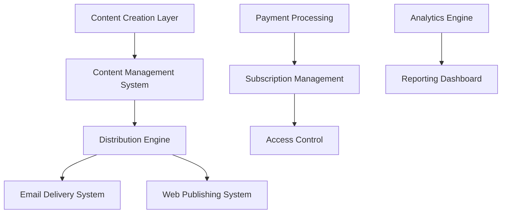

| Component | Primary Capability |
| --- | --- |
| Content Management | Rich text editing, media handling, version control |
| Distribution Engine | Multi-channel content delivery and scheduling |
| Subscription System | Payment processing, tier management, access control |
| Analytics Platform | Performance tracking, audience insights, revenue analytics |

## Success Criteria

| Category | Metrics |
| --- | --- |
| Platform Performance | - Page load time \< 2s<br>- Email delivery within 5 minutes<br>- 99.9% system uptime |
| Business Metrics | - Writer retention \> 80%<br>- Subscriber growth \> 20% quarterly<br>- Payment processing success \> 99% |
| User Satisfaction | - Writer satisfaction \> 4.5/5<br>- Reader engagement \> 60%<br>- Support resolution \< 24h |

# 3. SCOPE

## In-Scope Elements

### Core Features

| Feature Category | Included Capabilities |
| --- | --- |
| Content Creation | - Rich text editor<br>- Media management<br>- Publishing workflow<br>- Version control |
| Monetization | - Subscription management<br>- Payment processing<br>- Tiered access<br>- Revenue analytics |
| Distribution | - Email newsletter system<br>- Web publishing<br>- Content archiving<br>- Search functionality |
| Analytics | - Audience metrics<br>- Content performance<br>- Revenue tracking<br>- Email analytics |

### Implementation Boundaries

| Boundary Type | Coverage |
| --- | --- |
| User Groups | - Content creators<br>- Subscribers<br>- Platform administrators |
| Geographic Scope | - Global platform availability<br>- Multi-currency support<br>- GDPR/CCPA compliance |
| Data Domains | - User data<br>- Content assets<br>- Transaction records<br>- Analytics data |

## Out-of-Scope Elements

| Category | Excluded Elements |
| --- | --- |
| Platform Features | - Native mobile applications<br>- Offline content editing<br>- Print publication features<br>- Direct advertising integration |
| Technical Scope | - Custom domain SSL management<br>- Third-party content syndication<br>- Podcast/video hosting<br>- Community forum features |
| Future Considerations | - Content marketplace<br>- Advanced analytics tools<br>- API marketplace<br>- White-label solutions |

# 4. SYSTEM ARCHITECTURE

## High-Level Architecture

```mermaid
C4Context
    title System Context Diagram - Substack Replica Platform

    Person(writer, "Content Creator", "Writes and publishes content")
    Person(reader, "Subscriber", "Consumes and pays for content")
    
    System_Boundary(platform, "Substack Replica Platform") {
        System(cms, "Content Management")
        System(delivery, "Content Delivery")
        System(subscription, "Subscription Management")
        System(analytics, "Analytics Engine")
    }

    System_Ext(payment, "Payment Processors")
    System_Ext(email, "Email Service Providers")
    System_Ext(storage, "Cloud Storage")
    System_Ext(cdn, "Content Delivery Network")

    Rel(writer, platform, "Creates content")
    Rel(reader, platform, "Subscribes and reads")
    Rel(platform, payment, "Processes payments")
    Rel(platform, email, "Sends newsletters")
    Rel(platform, storage, "Stores media")
    Rel(platform, cdn, "Delivers assets")
```

## Container Architecture

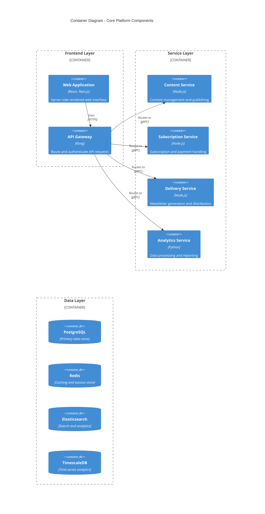

## Component Details

| Component | Technology Stack | Purpose | Scaling Strategy |
| --- | --- | --- | --- |
| Web Application | React, Next.js | User interface and SSR | Horizontal scaling with CDN |
| API Gateway | Kong | Request routing and auth | Multi-region deployment |
| Content Service | Node.js, Express | Content management | Horizontal pod autoscaling |
| Subscription Service | Node.js, Express | Payment processing | Horizontal pod autoscaling |
| Delivery Service | Node.js, Bull | Email distribution | Queue-based scaling |
| Analytics Service | Python, FastAPI | Data processing | Worker pool scaling |

## Data Flow Architecture

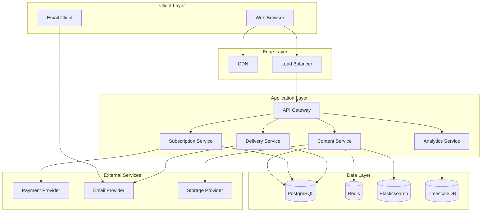

## Deployment Architecture

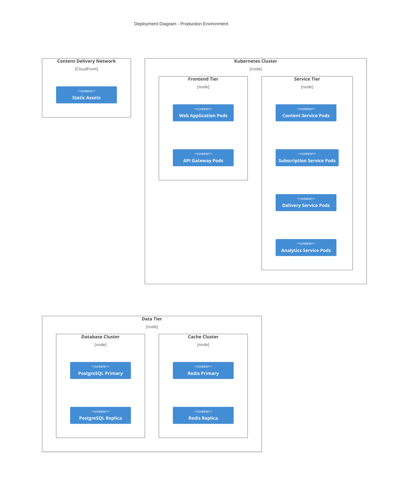

## Technical Decisions

### Architecture Style

- Microservices architecture for independent scaling and deployment
- Event-driven communication for asynchronous operations
- CQRS pattern for read/write optimization

### Data Storage

| Store Type | Technology | Purpose |
| --- | --- | --- |
| Primary Database | PostgreSQL | Transactional data |
| Cache | Redis | Session and content cache |
| Search Engine | Elasticsearch | Content search and discovery |
| Time-series | TimescaleDB | Analytics and metrics |

### Cross-Cutting Concerns

| Concern | Implementation | Details |
| --- | --- | --- |
| Monitoring | Prometheus/Grafana | - Infrastructure metrics<br>- Application metrics<br>- Business metrics |
| Logging | ELK Stack | - Centralized logging<br>- Log aggregation<br>- Search and analysis |
| Tracing | Jaeger | - Distributed tracing<br>- Performance monitoring<br>- Request tracking |
| Security | OAuth2/JWT | - Authentication<br>- Authorization<br>- API security |
| Resilience | Circuit Breakers | - Fault tolerance<br>- Rate limiting<br>- Fallback mechanisms |

# 5. SYSTEM DESIGN

## User Interface Design

### Design System Specifications

| Component | Requirements | Implementation |
| --- | --- | --- |
| Typography | - Primary: Inter<br>- Secondary: Merriweather<br>- Code: JetBrains Mono | - Font size scale: 12/14/16/18/24/32/48px<br>- Line height: 1.5<br>- Letter spacing: -0.02em |
| Color System | - Primary palette<br>- Secondary palette<br>- Semantic colors<br>- Dark mode variants | - Light/Dark themes<br>- WCAG AAA contrast<br>- Color-blind safe<br>- CSS custom properties |
| Layout Grid | - 12-column grid<br>- Responsive breakpoints<br>- Container widths | - Mobile: 320px<br>- Tablet: 768px<br>- Desktop: 1200px<br>- Max-width: 1440px |
| Components | - Atomic design system<br>- Reusable patterns<br>- State variations | - Material Design based<br>- Custom publishing components<br>- Storybook documentation |

### Interface Elements

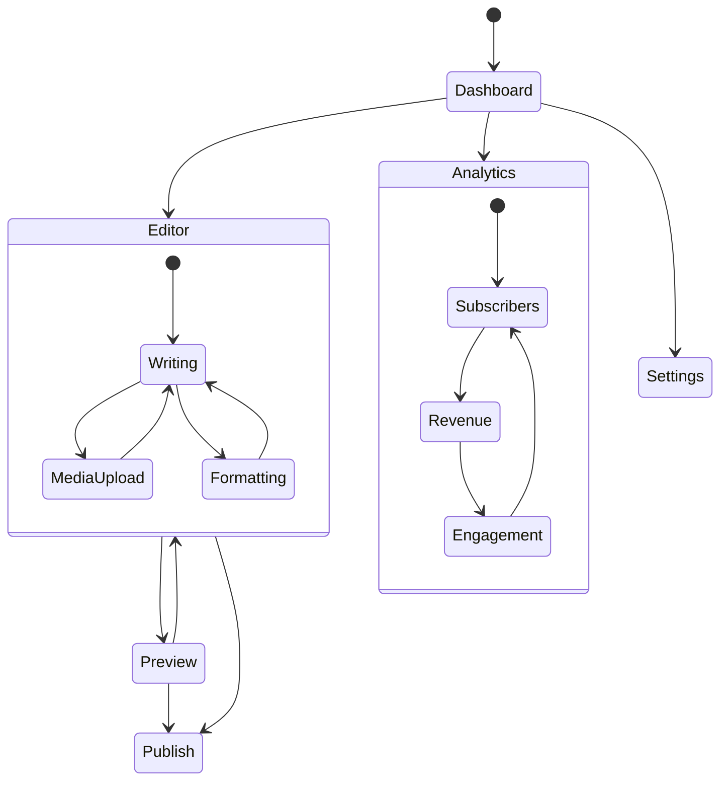

### Critical User Flows

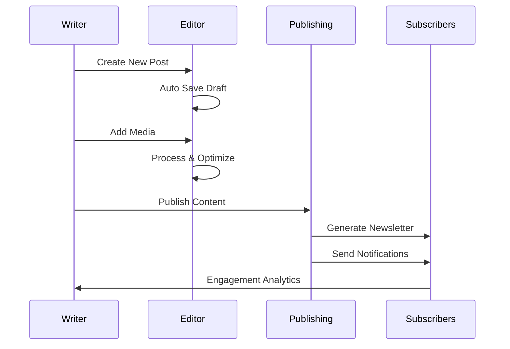

### Accessibility Standards

| Category | Requirement | Implementation |
| --- | --- | --- |
| WCAG Level | AA Compliance | - Semantic HTML<br>- ARIA labels<br>- Keyboard navigation<br>- Focus management |
| Color Contrast | 4.5:1 minimum | - Automated testing<br>- Contrast checker<br>- Alternative themes |
| Screen Readers | Full support | - Alt text<br>- ARIA roles<br>- Semantic structure |
| Keyboard Access | Complete navigation | - Focus indicators<br>- Skip links<br>- Shortcut keys |

## Database Design

### Schema Design

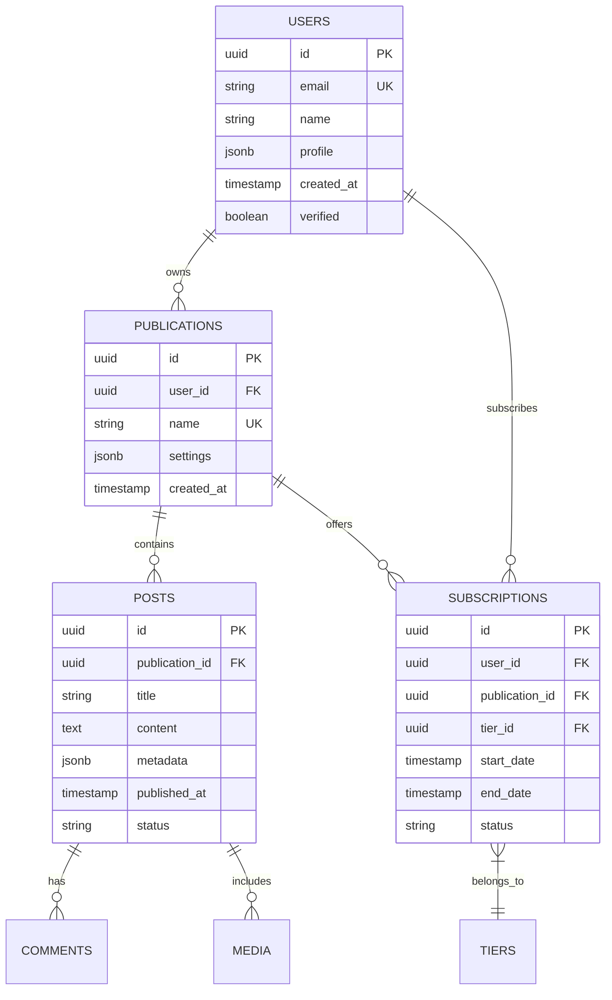

### Data Management Strategy

| Aspect | Strategy | Implementation |
| --- | --- | --- |
| Partitioning | Time-based | - Monthly post partitions<br>- Subscriber history partitions |
| Indexing | Selective indexes | - B-tree for lookups<br>- GiST for search<br>- Partial indexes |
| Caching | Multi-level | - Redis for sessions<br>- PostgreSQL cache<br>- CDN for assets |
| Backup | Continuous | - WAL archiving<br>- Daily snapshots<br>- Cross-region replication |

### Performance Optimization

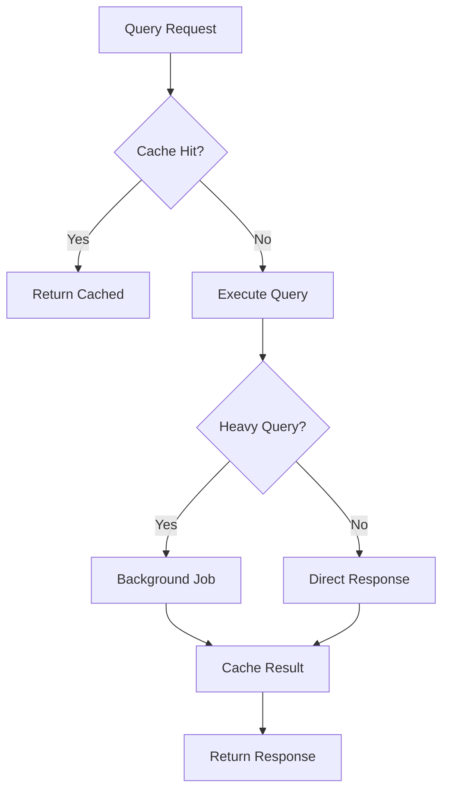

## API Design

### API Architecture

| Component | Specification | Implementation |
| --- | --- | --- |
| Protocol | REST/GraphQL | - HTTP/2<br>- WebSocket for real-time |
| Authentication | OAuth 2.0 + JWT | - Access/Refresh tokens<br>- Scope-based auth |
| Rate Limiting | Token bucket | - 1000 req/hour/user<br>- 100 req/min/endpoint |
| Versioning | URI versioning | - /v1/, /v2/<br>- Deprecation headers |

### Endpoint Specifications

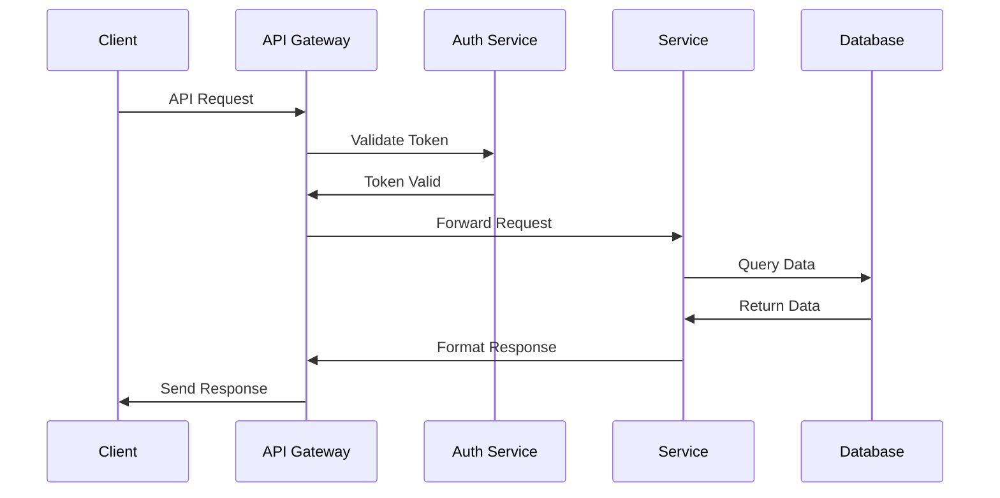

### Integration Patterns

| Pattern | Purpose | Implementation |
| --- | --- | --- |
| Circuit Breaker | Fault tolerance | - Failure threshold: 50%<br>- Reset timeout: 30s |
| Retry Policy | Reliability | - Max attempts: 3<br>- Exponential backoff |
| Rate Limiting | Protection | - Token bucket algorithm<br>- Redis backend |
| Caching | Performance | - Cache-Control headers<br>- ETags |

# 6. TECHNOLOGY STACK

## Programming Languages

| Layer | Language | Version | Justification |
| --- | --- | --- | --- |
| Backend | Node.js | 18.x LTS | - Excellent async I/O performance for real-time features<br>- Rich ecosystem for content management<br>- Strong TypeScript support<br>- Proven scalability for similar platforms |
| Frontend | TypeScript | 4.9.x | - Type safety for large-scale application<br>- Enhanced developer productivity<br>- Better maintainability<br>- Native React integration |
| Data Processing | Python | 3.11.x | - Superior analytics and ML capabilities<br>- Rich data processing libraries<br>- Excellent for async task processing<br>- Strong community support |
| Infrastructure | Go | 1.19.x | - High-performance microservices<br>- Efficient resource utilization<br>- Strong concurrency support<br>- Native cloud integration |

## Frameworks & Libraries

### Backend Frameworks

| Framework | Version | Purpose | Justification |
| --- | --- | --- | --- |
| Next.js | 13.x | SSR & API | - Server-side rendering for SEO<br>- API routes integration<br>- Optimized content delivery<br>- Built-in performance features |
| Express | 4.18.x | Service Layer | - Proven reliability<br>- Middleware ecosystem<br>- Easy integration<br>- Performance at scale |
| FastAPI | 0.95.x | Analytics Service | - High-performance async<br>- Auto API documentation<br>- Python data science integration<br>- Type safety |

### Frontend Libraries

| Library | Version | Purpose |
| --- | --- | --- |
| React | 18.x | UI Framework |
| TailwindCSS | 3.x | Styling |
| ProseMirror | 1.x | Rich Text Editor |
| React Query | 4.x | Data Fetching |
| Redux Toolkit | 1.9.x | State Management |

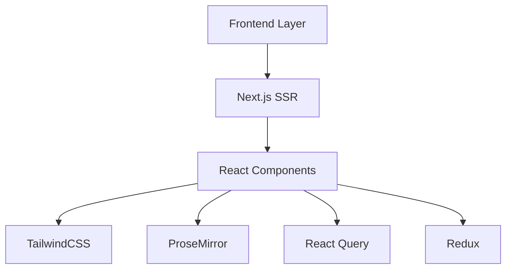

## Databases & Storage

### Primary Databases

| Database | Version | Purpose | Justification |
| --- | --- | --- | --- |
| PostgreSQL | 15.x | Primary Data Store | - ACID compliance<br>- JSON support<br>- Full-text search<br>- Transactional integrity |
| TimescaleDB | 2.9.x | Time-series Data | - Optimized for analytics<br>- PostgreSQL compatible<br>- Efficient data retention<br>- High write throughput |
| Redis | 7.x | Caching & Sessions | - High performance<br>- Pub/sub support<br>- Session management<br>- Rate limiting |
| Elasticsearch | 8.x | Search & Discovery | - Full-text search<br>- Content indexing<br>- Analytics capabilities<br>- Scalable architecture |

### Storage Services

| Service | Purpose | Configuration |
| --- | --- | --- |
| AWS S3 | Media Storage | - Multi-region replication<br>- Lifecycle policies<br>- CDN integration |
| AWS EFS | Shared Storage | - Container persistence<br>- Backup storage<br>- Cross-AZ replication |

## Third-Party Services

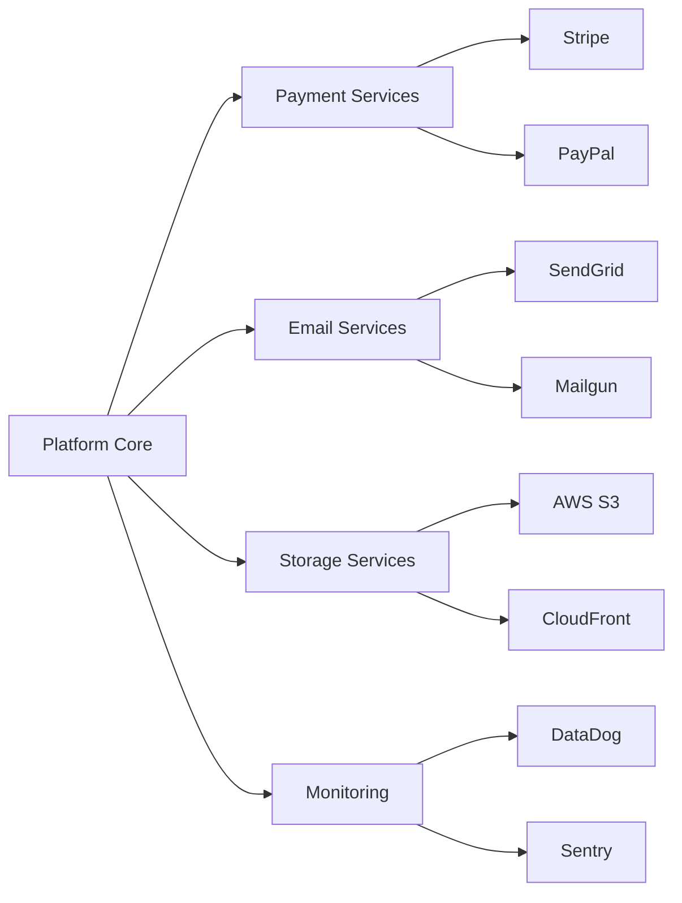

### Service Integration Matrix

| Category | Primary Service | Backup Service | Purpose |
| --- | --- | --- | --- |
| Payments | Stripe | PayPal | Payment processing |
| Email | SendGrid | Mailgun | Newsletter delivery |
| CDN | CloudFront | Fastly | Content delivery |
| Monitoring | DataDog | Grafana | System monitoring |
| Error Tracking | Sentry | Rollbar | Error management |
| Authentication | Auth0 | Cognito | Identity management |

## Development & Deployment

### Development Environment

| Tool | Version | Purpose |
| --- | --- | --- |
| Docker | 20.10.x | Containerization |
| Kubernetes | 1.26.x | Container orchestration |
| Terraform | 1.4.x | Infrastructure as code |
| GitHub Actions | N/A | CI/CD pipeline |

### Deployment Pipeline

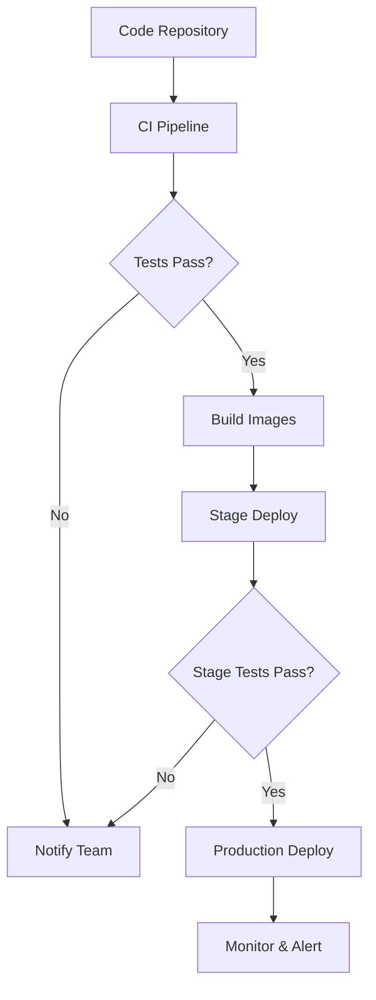

### Infrastructure Requirements

| Component | Specification | Scaling Strategy |
| --- | --- | --- |
| Web Tier | t3.large | Horizontal auto-scaling |
| Service Tier | c6g.xlarge | Pod auto-scaling |
| Database | r6g.2xlarge | Vertical with read replicas |
| Cache | r6g.large | Cluster with auto-scaling |
| Search | c6g.2xlarge | Multi-node cluster |

## User Interface Design

### Design System Specifications

| Component | Requirements | Implementation |
| --- | --- | --- |
| Typography | - Primary: Inter<br>- Secondary: Merriweather<br>- Code: JetBrains Mono | - Font size scale: 12/14/16/18/24/32/48px<br>- Line height: 1.5<br>- Letter spacing: -0.02em |
| Color System | - Primary palette<br>- Secondary palette<br>- Semantic colors<br>- Dark mode variants | - Light/Dark themes<br>- WCAG AAA contrast<br>- Color-blind safe<br>- CSS custom properties |
| Layout Grid | - 12-column grid<br>- Responsive breakpoints<br>- Container widths | - Mobile: 320px<br>- Tablet: 768px<br>- Desktop: 1200px<br>- Max-width: 1440px |
| Components | - Atomic design system<br>- Reusable patterns<br>- State variations | - Material Design based<br>- Custom publishing components<br>- Storybook documentation |

### Interface Elements


### Critical User Flows


### Accessibility Standards

| Category | Requirement | Implementation |
| --- | --- | --- |
| WCAG Level | AA Compliance | - Semantic HTML<br>- ARIA labels<br>- Keyboard navigation<br>- Focus management |
| Color Contrast | 4.5:1 minimum | - Automated testing<br>- Contrast checker<br>- Alternative themes |
| Screen Readers | Full support | - Alt text<br>- ARIA roles<br>- Semantic structure |
| Keyboard Access | Complete navigation | - Focus indicators<br>- Skip links<br>- Shortcut keys |

## Database Design

### Schema Design


### Data Management Strategy

| Aspect | Strategy | Implementation |
| --- | --- | --- |
| Partitioning | Time-based | - Monthly post partitions<br>- Subscriber history partitions |
| Indexing | Selective indexes | - B-tree for lookups<br>- GiST for search<br>- Partial indexes |
| Caching | Multi-level | - Redis for sessions<br>- PostgreSQL cache<br>- CDN for assets |
| Backup | Continuous | - WAL archiving<br>- Daily snapshots<br>- Cross-region replication |

### Performance Optimization


## API Design

### API Architecture

| Component | Specification | Implementation |
| --- | --- | --- |
| Protocol | REST/GraphQL | - HTTP/2<br>- WebSocket for real-time |
| Authentication | OAuth 2.0 + JWT | - Access/Refresh tokens<br>- Scope-based auth |
| Rate Limiting | Token bucket | - 1000 req/hour/user<br>- 100 req/min/endpoint |
| Versioning | URI versioning | - /v1/, /v2/<br>- Deprecation headers |

### Endpoint Specifications


### Integration Patterns

| Pattern | Purpose | Implementation |
| --- | --- | --- |
| Circuit Breaker | Fault tolerance | - Failure threshold: 50%<br>- Reset timeout: 30s |
| Retry Policy | Reliability | - Max attempts: 3<br>- Exponential backoff |
| Rate Limiting | Protection | - Token bucket algorithm<br>- Redis backend |
| Caching | Performance | - Cache-Control headers<br>- ETags |

# USER INTERFACE DESIGN

## Key Components Legend

| Symbol | Meaning |
| --- | --- |
| \[#\] | Dashboard/Menu |
| \[@\] | User Profile |
| \[$\] | Payment/Subscription |
| \[+\] | Create New |
| \[x\] | Close/Delete |
| \[?\] | Help/Documentation |
| \[i\] | Information |
| \[^\] | Upload Media |
| \[\<\] \[\>\] | Navigation |
| \[!\] | Alert/Warning |
| \[=\] | Settings |
| \[\*\] | Featured/Important |

## Writer Dashboard

```
+----------------------------------------------------------+
|  [#] Substack Replica    [@] Profile    [$] Revenue    [=] |
+----------------------------------------------------------+
|                                                           |
|  [*] Quick Stats                                         |
|  +------------------+  +------------------+              |
|  | Subscribers      |  | Revenue          |              |
|  | 1,234           |  | $4,567           |              |
|  +------------------+  +------------------+              |
|                                                          |
|  [+] New Post                Recent Posts                |
|  +--------------------------------------------------+   |
|  | Title                    | Status    | Views      |   |
|  |--------------------------|-----------|-------------|   |
|  | Latest Update           | Published | 1,234      |   |
|  | Draft in Progress       | Draft     | -          |   |
|  +--------------------------------------------------+   |
|                                                          |
|  [i] Engagement            Newsletter Stats              |
|  [============================] 76% Open Rate            |
|  [==================] 42% Click Rate                     |
+----------------------------------------------------------+
```

## Content Editor

```
+----------------------------------------------------------+
|  [<] Back to Dashboard    [Save Draft]    [Publish]       |
+----------------------------------------------------------+
|                                                           |
| [...........................] Title                       |
|                                                           |
| +----------------+ Format: [v] Markdown                   |
| | B I U _/ # {} | [^] Media  [?] Help                    |
| +----------------+                                        |
|                                                          |
| +--------------------------------------------------+    |
| |                                                   |    |
| |                                                   |    |
| |          Main Content Editor Area                 |    |
| |                                                   |    |
| |                                                   |    |
| +--------------------------------------------------+    |
|                                                          |
| Preview:                                                 |
| ( ) Email Newsletter  ( ) Web Post  ( ) Both            |
|                                                          |
| [Preview]                     [Schedule >]               |
+----------------------------------------------------------+
```

## Subscriber View

```
+----------------------------------------------------------+
|  Publication Name                 [Subscribe] [$] Login    |
+----------------------------------------------------------+
|                                                           |
| Featured Posts                                            |
| +--------------------------------------------------+     |
| | [*] Premium Article Title                         |     |
| | Preview text of the article goes here...          |     |
| | [$] Subscribe to Read More                        |     |
| +--------------------------------------------------+     |
|                                                           |
| Recent Posts                                              |
| +--------------------------------------------------+     |
| | Free Article Title                                |     |
| | Full article text available...                    |     |
| | [>] Read More                                    |     |
| +--------------------------------------------------+     |
|                                                           |
| Subscribe Options:                                        |
| ( ) Monthly - $5/mo                                      |
| ( ) Annual - $50/yr [i] Save 17%                        |
| [ ] Include premium newsletter                           |
|                                                          |
| [Subscribe Now]                                          |
+----------------------------------------------------------+
```

## Settings Panel

```
+----------------------------------------------------------+
|  [<] Back    Publication Settings                         |
+----------------------------------------------------------+
|                                                           |
| Branding                                                  |
| Publication Name: [..................................]     |
| Logo: [^] Upload                                          |
|                                                           |
| Subscription Tiers                                        |
| +--------------------------------------------------+     |
| | Free Tier                                         |     |
| | [x] Enable free posts                             |     |
| | [x] Allow preview of premium content              |     |
| +--------------------------------------------------+     |
| | Premium Tier                                      |     |
| | Price: [$] [...] /month                          |     |
| | Features: [ ] Email Newsletter                    |     |
| |           [ ] Premium Content                     |     |
| |           [ ] Community Access                    |     |
| +--------------------------------------------------+     |
|                                                           |
| Email Settings                                            |
| Template: [v] Classic                                     |
| Sender Name: [..................................]         |
| Reply-to: [..................................]           |
|                                                           |
| [Save Changes]                [Test Email]                |
+----------------------------------------------------------+
```

## Mobile Responsive Layout

```
+----------------------+
| [#] Menu  [@] Login |
+----------------------+
| [+] New Post        |
|                     |
| Quick Stats         |
| Subs: 1,234        |
| Views: 5,678       |
|                     |
| Recent Posts        |
| +------------------+
| | Latest Post     |
| | Draft Post      |
| +------------------+
|                     |
| [=] Settings       |
+----------------------+
```

## Navigation Flow

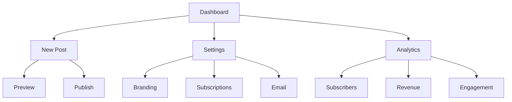

## Responsive Breakpoints

| Screen Size | Layout Adjustments |
| --- | --- |
| Desktop (\>1200px) | Full three-column layout |
| Tablet (768px-1199px) | Two-column layout, condensed sidebar |
| Mobile (\<767px) | Single column, collapsible menu |

## Accessibility Features

| Feature | Implementation |
| --- | --- |
| Keyboard Navigation | Tab order, focus indicators |
| Screen Readers | ARIA labels, semantic HTML |
| Color Contrast | WCAG AA compliance |
| Text Scaling | Responsive typography |
| Error States | Clear visual and text indicators |

# SECURITY CONSIDERATIONS

## AUTHENTICATION AND AUTHORIZATION

### Authentication Methods

| Method | Implementation | Use Case |
| --- | --- | --- |
| OAuth 2.0 + JWT | - Auth0 primary provider<br>- AWS Cognito backup<br>- JWT expiry: 1 hour<br>- Refresh token: 30 days | Primary user authentication |
| API Keys | - HMAC-based<br>- Auto-rotation every 90 days<br>- Rate limiting enforced | Service-to-service auth |
| 2FA | - TOTP-based<br>- SMS fallback<br>- Recovery codes<br>- Remember device: 30 days | High-security operations |

### Authorization Model

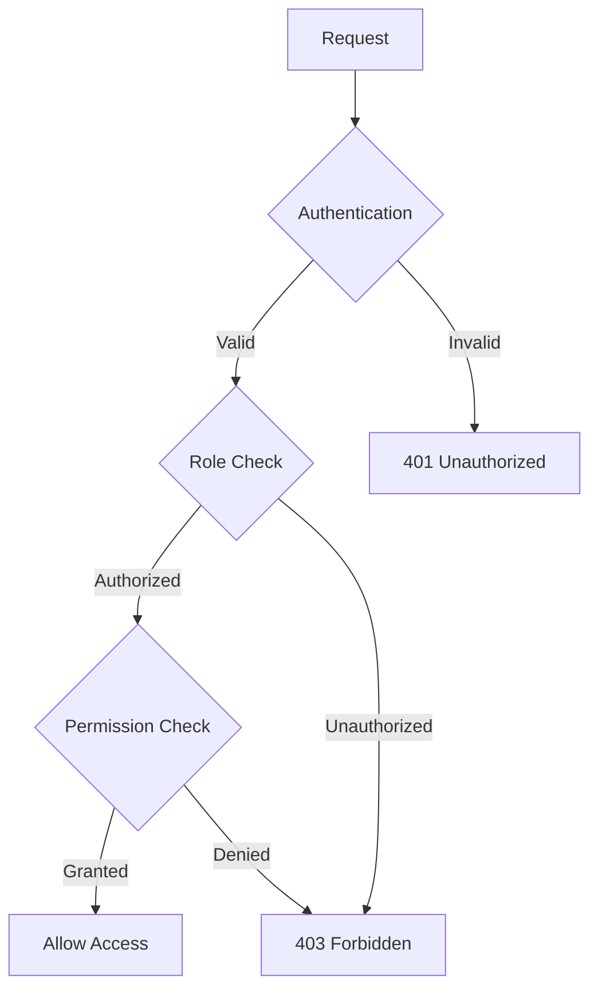

### Role-Based Access Control

| Role | Permissions | Access Level |
| --- | --- | --- |
| Admin | - Full system access<br>- User management<br>- System configuration<br>- Security settings | Complete |
| Writer | - Content management<br>- Subscriber management<br>- Analytics access<br>- Payment settings | Publication Scope |
| Subscriber | - Content access<br>- Comment posting<br>- Profile management<br>- Subscription management | Subscription Tier |
| Guest | - Public content view<br>- Search access<br>- Registration | Public Only |

## DATA SECURITY

### Data Classification

| Level | Type | Protection Measures |
| --- | --- | --- |
| Critical | - Payment data<br>- Authentication credentials | - Field-level encryption<br>- Hardware security modules<br>- Access logging |
| Sensitive | - Personal information<br>- Subscription details | - At-rest encryption<br>- Access control<br>- Audit trails |
| Internal | - Analytics data<br>- Content drafts | - Standard encryption<br>- Role-based access<br>- Regular backups |
| Public | - Published content<br>- Public profiles | - Integrity checks<br>- Cache controls |

### Encryption Implementation

```mermaid
flowchart TD
    A[Data Input] --> B{Classification Check}
    B -->|Critical| C[HSM Encryption]
    B -->|Sensitive| D[AES-256 Encryption]
    B -->|Internal| E[Standard Encryption]
    B -->|Public| F[Integrity Check]
    C --> G[Secure Storage]
    D --> G
    E --> G
    F --> H[Public Storage]
```

### Data Protection Measures

| Measure | Implementation | Scope |
| --- | --- | --- |
| At-Rest Encryption | - AES-256-GCM<br>- Key rotation<br>- Secure key storage | All stored data |
| In-Transit Encryption | - TLS 1.3<br>- Perfect forward secrecy<br>- Strong cipher suites | All communications |
| Backup Encryption | - Encrypted snapshots<br>- Secure key management<br>- Offline key storage | All backups |

## SECURITY PROTOCOLS

### Security Monitoring

```mermaid
sequenceDiagram
    participant System
    participant IDS
    participant SIEM
    participant SOC
    
    System->>IDS: Log Security Events
    IDS->>SIEM: Forward Alerts
    SIEM->>SOC: Analyze Threats
    SOC->>System: Apply Mitigations
    
    loop Continuous Monitoring
        System->>SIEM: Send Logs
        SIEM->>SOC: Update Dashboard
    end
```

### Security Controls

| Control Type | Measures | Implementation |
| --- | --- | --- |
| Preventive | - WAF<br>- Rate limiting<br>- Input validation | - AWS WAF<br>- Redis rate limiter<br>- JSON Schema validation |
| Detective | - IDS/IPS<br>- Log monitoring<br>- Integrity checking | - Snort<br>- ELK Stack<br>- File checksums |
| Corrective | - Auto-blocking<br>- Incident response<br>- System restoration | - IP blocking<br>- PagerDuty alerts<br>- Backup restoration |

### Compliance Protocols

| Requirement | Implementation | Validation |
| --- | --- | --- |
| PCI DSS | - Tokenization<br>- Network segmentation<br>- Access controls | Quarterly scans |
| GDPR | - Data minimization<br>- Consent management<br>- Right to erasure | Annual audit |
| SOC 2 | - Security monitoring<br>- Change management<br>- Access review | Semi-annual review |

# 7. INFRASTRUCTURE

## Deployment Environment

| Environment | Purpose | Configuration |
| --- | --- | --- |
| Development | Local development and testing | - Docker Compose<br>- Local Kubernetes (minikube)<br>- Mock external services |
| Staging | Pre-production testing | - AWS EKS cluster<br>- Replicated production setup<br>- Test data isolation |
| Production | Live system deployment | - Multi-region AWS infrastructure<br>- High availability configuration<br>- Auto-scaling enabled |

### Environment Architecture

```mermaid
flowchart TD
    subgraph Production
        A[AWS Multi-Region]
        B[Primary Region]
        C[DR Region]
        A --> B
        A --> C
        B --> D[EKS Cluster]
        C --> E[Standby EKS]
    end
    
    subgraph Staging
        F[Single Region]
        G[EKS Cluster]
        F --> G
    end
    
    subgraph Development
        H[Local Environment]
        I[Docker Compose]
        J[Minikube]
        H --> I
        H --> J
    end
```

## Cloud Services

| Service | Purpose | Configuration |
| --- | --- | --- |
| AWS EKS | Container orchestration | - v1.26 cluster<br>- Multi-AZ deployment<br>- Managed node groups |
| AWS RDS | Database hosting | - PostgreSQL 15.x<br>- Multi-AZ deployment<br>- Auto-scaling storage |
| AWS ElastiCache | Redis caching | - Redis 7.x cluster<br>- Multi-AZ replication<br>- Auto-failover |
| AWS OpenSearch | Search functionality | - v8.x deployment<br>- Multi-AZ configuration<br>- Auto-scaling enabled |
| AWS S3 | Object storage | - Cross-region replication<br>- Versioning enabled<br>- Lifecycle policies |
| AWS CloudFront | CDN services | - Global edge locations<br>- Custom domain SSL<br>- Cache optimization |

### Cloud Architecture

```mermaid
graph TD
    subgraph Edge Layer
        A[CloudFront CDN]
        B[Route 53 DNS]
    end
    
    subgraph Application Layer
        C[EKS Cluster]
        D[EC2 Node Groups]
        E[Auto Scaling Groups]
    end
    
    subgraph Data Layer
        F[RDS PostgreSQL]
        G[ElastiCache Redis]
        H[OpenSearch Service]
        I[S3 Storage]
    end
    
    A --> C
    B --> A
    C --> D
    D --> E
    C --> F
    C --> G
    C --> H
    C --> I
```

## Containerization

### Docker Configuration

| Component | Base Image | Configuration |
| --- | --- | --- |
| Web Application | node:18-alpine | - Multi-stage build<br>- Production optimization<br>- Security hardening |
| API Services | node:18-alpine | - Minimal dependencies<br>- Non-root user<br>- Health checks |
| Analytics Service | python:3.11-slim | - Optimized dependencies<br>- Volume mounting<br>- Resource limits |
| Background Workers | node:18-alpine | - Queue processing<br>- Resource allocation<br>- Persistent storage |

### Container Architecture

```mermaid
graph TD
    subgraph Docker Registry
        A[ECR Repository]
    end
    
    subgraph Container Images
        B[Web Image]
        C[API Image]
        D[Analytics Image]
        E[Worker Image]
    end
    
    subgraph Runtime
        F[Web Containers]
        G[API Containers]
        H[Analytics Containers]
        I[Worker Containers]
    end
    
    A --> B
    A --> C
    A --> D
    A --> E
    B --> F
    C --> G
    D --> H
    E --> I
```

## Orchestration

### Kubernetes Configuration

| Resource | Purpose | Specifications |
| --- | --- | --- |
| Deployments | Application workloads | - Rolling updates<br>- Auto-scaling rules<br>- Resource quotas |
| Services | Internal networking | - Load balancing<br>- Service discovery<br>- External access |
| ConfigMaps | Configuration | - Environment variables<br>- Application config<br>- Feature flags |
| Secrets | Sensitive data | - Encrypted storage<br>- Access control<br>- Auto-rotation |

### Kubernetes Architecture

```mermaid
graph TD
    subgraph Control Plane
        A[API Server]
        B[Controller Manager]
        C[Scheduler]
        D[etcd]
    end
    
    subgraph Worker Nodes
        E[Node 1]
        F[Node 2]
        G[Node N]
    end
    
    subgraph Pod Management
        H[HPA]
        I[VPA]
        J[PDB]
    end
    
    A --> E
    A --> F
    A --> G
    H --> A
    I --> A
    J --> A
```

## CI/CD Pipeline

### Pipeline Stages

```mermaid
flowchart LR
    A[Source] --> B[Build]
    B --> C[Test]
    C --> D[Security Scan]
    D --> E[Artifact Creation]
    E --> F[Deploy to Staging]
    F --> G{Approval}
    G -->|Approved| H[Deploy to Production]
    G -->|Rejected| I[Notify Team]
```

### Pipeline Configuration

| Stage | Tools | Configuration |
| --- | --- | --- |
| Source Control | GitHub | - Branch protection<br>- Required reviews<br>- Status checks |
| Build | GitHub Actions | - Matrix builds<br>- Caching<br>- Parallel execution |
| Testing | Jest/PyTest | - Unit tests<br>- Integration tests<br>- E2E tests |
| Security | Snyk/SonarQube | - Vulnerability scanning<br>- Code quality<br>- License compliance |
| Deployment | ArgoCD | - GitOps workflow<br>- Automated rollbacks<br>- Progressive delivery |

### Deployment Strategy

| Environment | Strategy | Configuration |
| --- | --- | --- |
| Staging | Blue/Green | - Full environment clone<br>- Automated testing<br>- Quick rollback |
| Production | Rolling Update | - Zero-downtime updates<br>- Canary deployments<br>- Traffic shifting |
| DR | Active-Passive | - Cross-region replication<br>- Automated failover<br>- Regular testing |

# APPENDICES

## GLOSSARY

| Term | Definition |
| --- | --- |
| Access Control | System for managing and restricting user access to content based on subscription status |
| Bounce Rate | Percentage of emails that were undeliverable to subscriber inboxes |
| Canary Deployment | Technique of rolling out changes to a small subset of users before full deployment |
| Circuit Breaker | Design pattern that prevents system failure by stopping operations when error thresholds are reached |
| Content Delivery Network | Distributed network of servers that delivers content to users based on geographic location |
| Dark Mode | Alternative color scheme optimized for low-light environments |
| Edge Location | Geographic point of presence for content distribution |
| Feature Flag | Configuration option that enables/disables functionality in production |
| GitOps | Infrastructure and application management using Git as source of truth |
| Hot Reload | Development feature allowing code changes to reflect immediately without full restart |
| Infinite Scroll | UI pattern where content loads continuously as user scrolls |
| Multi-tenant | Architecture supporting multiple isolated user groups on shared infrastructure |
| Rate Limiting | Control mechanism to restrict number of requests from a source |
| Rolling Update | Deployment strategy where instances are updated gradually without downtime |
| Webhook | HTTP callback that delivers real-time information to other systems |

## ACRONYMS

| Acronym | Full Form |
| --- | --- |
| ACID | Atomicity, Consistency, Isolation, Durability |
| ARIA | Accessible Rich Internet Applications |
| CQRS | Command Query Responsibility Segregation |
| DNS | Domain Name System |
| ELK | Elasticsearch, Logstash, Kibana |
| ESP | Email Service Provider |
| HMAC | Hash-based Message Authentication Code |
| HPA | Horizontal Pod Autoscaling |
| IDS | Intrusion Detection System |
| IPS | Intrusion Prevention System |
| JWT | JSON Web Token |
| MFA | Multi-Factor Authentication |
| RBAC | Role-Based Access Control |
| SIEM | Security Information and Event Management |
| SOC | Security Operations Center |
| SSR | Server-Side Rendering |
| TOTP | Time-based One-Time Password |
| VPA | Vertical Pod Autoscaling |
| WAF | Web Application Firewall |
| WCAG | Web Content Accessibility Guidelines |

## ADDITIONAL REFERENCES

| Category | Resource | Purpose |
| --- | --- | --- |
| Development | Next.js Documentation | SSR implementation guide |
| Development | TypeScript Handbook | Type system reference |
| Infrastructure | Kubernetes Documentation | Container orchestration guide |
| Infrastructure | Terraform Registry | Infrastructure as code modules |
| Security | OWASP Top 10 | Security vulnerability prevention |
| Security | NIST Cybersecurity Framework | Security best practices |
| Compliance | SOC 2 Compliance Guide | Security control implementation |
| Compliance | GDPR Documentation | Privacy requirement implementation |
| Performance | Web Vitals | Frontend performance metrics |
| Performance | Database Indexing Strategies | Query optimization guide |

## DEPLOYMENT CHECKLIST

```mermaid
stateDiagram-v2
    [*] --> CodeReview
    CodeReview --> SecurityScan
    SecurityScan --> Build
    Build --> Test
    Test --> StagingDeploy
    StagingDeploy --> QAVerification
    QAVerification --> ApprovalGate
    ApprovalGate --> ProductionDeploy
    ProductionDeploy --> Monitoring
    Monitoring --> [*]
    
    QAVerification --> StagingDeploy: Failed
    SecurityScan --> CodeReview: Failed
    Test --> Build: Failed
```

## SYSTEM DEPENDENCIES

```mermaid
graph TD
    A[Frontend Application] --> B[API Gateway]
    B --> C[Authentication Service]
    B --> D[Content Service]
    B --> E[Payment Service]
    B --> F[Email Service]
    
    C --> G[Identity Store]
    D --> H[Content Store]
    E --> I[Payment Provider]
    F --> J[Email Provider]
    
    K[CDN] --> A
    L[Monitoring] --> M[All Services]
    N[Logging] --> M
```

## ERROR HANDLING MATRIX

| Error Type | Severity | Response Strategy | Recovery Action |
| --- | --- | --- | --- |
| Database Connection | Critical | Circuit break, fallback to cache | Auto-reconnect, alert ops |
| API Rate Limit | High | Exponential backoff | Queue requests, throttle |
| Payment Failure | High | Retry with backoff | Notify user, maintain access |
| Email Bounce | Medium | Mark address invalid | Notify subscriber |
| Cache Miss | Low | Rebuild cache | Log and monitor frequency |
| Media Upload | Medium | Retry upload | Notify user, provide alternatives |